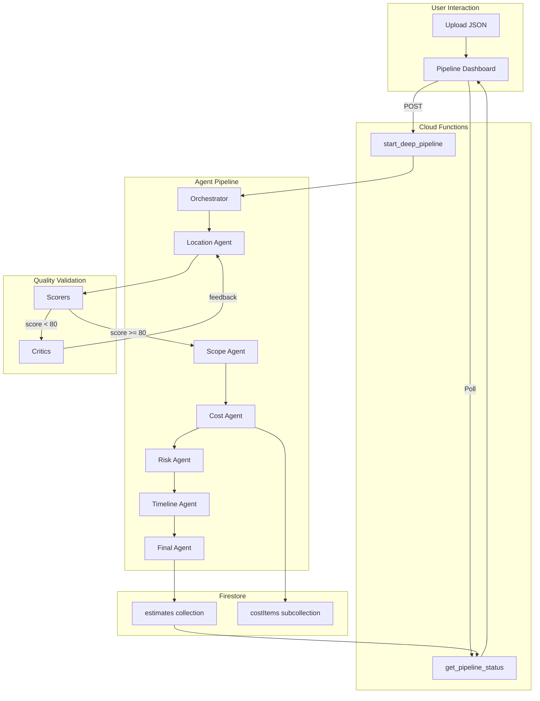

# Epic 2: Deep Agent Pipeline - Implementation Summary

**Status:** MERGED (PR #17 - True Agent Pipeline)
**Date Merged:** 2025-12-11
**Developer:** Dev 2
**Epic Goal:** Build an AI-powered construction cost estimation pipeline using 19 deep agents with scorer/critic validation for quality assurance.

---

## Overview

Epic 2 delivers the core intelligence of TrueCost: a sophisticated multi-agent pipeline that transforms a `ClarificationOutput` (project requirements, CAD data, scope) into a comprehensive construction cost estimate with Monte Carlo risk analysis, timeline scheduling, and executive summaries.

---

## Running the Pipeline Dashboard

The pipeline is controlled by a user via a web dashboard. To run it locally:

### Prerequisites

1. **Firebase Emulators** must be running:
   - Firestore on port `8081`
   - Functions on port `5001`

2. **Python environment** with dependencies installed in `functions/`

### Start the Dashboard

```bash
# Terminal 1: Start Firebase emulators (from project root)
firebase emulators:start

# Terminal 2: Serve the dashboard (from functions directory)
cd functions
python3 -m http.server 8000
```

Then open: **<http://localhost:8000/pipeline_dashboard.html>**

### Using the Dashboard

1. **Upload a ClarificationOutput JSON** - Click "Choose File" and select a valid `clarification-output.json` file (see `docs/clarification-output-example.json` for the schema)

2. **Start the Pipeline** - Click "Start Pipeline" to trigger `start_deep_pipeline` Cloud Function

3. **Monitor Progress** - The dashboard:
   - Shows each agent's status (pending/running/completed/failed)
   - Displays real-time scores (0-100) from scorer agents
   - Logs all agent communications
   - Updates a progress bar as agents complete

4. **View Results** - When complete, the dashboard displays:
   - Executive summary with P50/P80/P90 cost estimates
   - Cost breakdown by CSI division
   - Labor analysis by trade
   - Risk analysis with Monte Carlo results
   - Project schedule with task dependencies
   - Granular cost ledger items
   - Full bill of quantities

---

## Pipeline Architecture

### 19-Agent System

The pipeline uses a **Scorer + Critic validation pattern** that ensures output quality:

```
USER (Dashboard)
    │
    ▼
start_deep_pipeline (Cloud Function)
    │
    ▼
ORCHESTRATOR
    │
    ▼ (for each agent in sequence)
Primary Agent → Scorer (0-100) → Score ≥ 80? → Next Agent
                                      │
                                      ▼ (No)
                              Critic → Retry with feedback (max 2)
```

**Agent Breakdown:**

| Category | Count | Agents |
|----------|-------|--------|
| Primary | 6 | Location, Scope, Cost, Risk, Timeline, Final |
| Scorer | 6 | Objective 0-100 scoring for each primary |
| Critic | 6 | Qualitative feedback when score < 80 |
| Orchestrator | 1 | Flow coordination, retry management |

### Agent Execution Sequence

```
location → scope → cost → risk → timeline → final
```

Each agent receives accumulated context from all previous agents, building up the estimate progressively.

### Primary Agent Responsibilities

| Agent | Input | Output | Key Feature |
|-------|-------|--------|-------------|
| **Location** | ClarificationOutput | LocationFactors | Labor rates, permits, weather by ZIP |
| **Scope** | ClarificationOutput + Location | BillOfQuantities | CSI MasterFormat enrichment |
| **Cost** | BoQ + Location | CostEstimate | P50/P80/P90 three-tier pricing |
| **Risk** | Cost + BoQ | RiskAnalysis | Monte Carlo with 1000 iterations |
| **Timeline** | Scope + Cost | ProjectTimeline | Critical path, task dependencies |
| **Final** | All outputs | FinalEstimate | Executive summary synthesis |

---

## Technical Implementation

### Cloud Function Endpoints

| Endpoint | Method | Purpose |
|----------|--------|---------|
| `start_deep_pipeline` | POST | Initiate estimate pipeline |
| `get_pipeline_status` | POST | Real-time progress polling |
| `delete_estimate` | POST | Remove estimate + subcollections |
| `a2a_location` | POST | Location agent A2A endpoint |
| `a2a_scope` | POST | Scope agent A2A endpoint |
| `a2a_cost` | POST | Cost agent A2A endpoint |
| `a2a_risk` | POST | Risk agent A2A endpoint |
| `a2a_timeline` | POST | Timeline agent A2A endpoint |
| `a2a_final` | POST | Final agent A2A endpoint |
| `a2a_{agent}_scorer` | POST | Scorer endpoints (x6) |
| `a2a_{agent}_critic` | POST | Critic endpoints (x6) |

### Key Files

```
functions/
├── main.py                       # Cloud Function entry points (19 endpoints)
├── pipeline_dashboard.html       # User-facing dashboard UI
├── demo_pipeline.py              # Local testing with mock services
├── run_integration_test.py       # Integration tests
│
├── agents/
│   ├── orchestrator.py           # Pipeline coordination & retry logic
│   ├── agent_cards.py            # Agent metadata registry
│   ├── base_agent.py             # Base class for all agents
│   ├── primary/                  # 6 primary agents
│   │   ├── location_agent.py
│   │   ├── scope_agent.py
│   │   ├── cost_agent.py
│   │   ├── risk_agent.py
│   │   ├── timeline_agent.py
│   │   └── final_agent.py
│   ├── scorers/                  # 6 scorer agents
│   │   ├── base_scorer.py
│   │   ├── location_scorer.py
│   │   ├── scope_scorer.py
│   │   ├── cost_scorer.py
│   │   ├── risk_scorer.py
│   │   ├── timeline_scorer.py
│   │   └── final_scorer.py
│   └── critics/                  # 6 critic agents
│       ├── base_critic.py
│       ├── location_critic.py
│       ├── scope_critic.py
│       ├── cost_critic.py
│       ├── risk_critic.py
│       ├── timeline_critic.py
│       └── final_critic.py
│
├── models/                       # Pydantic models for all data contracts
│   ├── clarification_output.py   # Input schema v3.0.0
│   ├── location_factors.py
│   ├── bill_of_quantities.py
│   ├── cost_estimate.py
│   ├── risk_analysis.py
│   ├── timeline.py
│   ├── final_estimate.py
│   └── agent_output.py           # Pipeline status models
│
├── services/
│   ├── firestore_service.py      # Firestore CRUD operations
│   ├── a2a_client.py             # Agent-to-Agent communication
│   ├── llm_service.py            # OpenAI API integration
│   ├── cost_data_service.py      # Mock RSMeans-style data
│   └── monte_carlo_service.py    # Risk simulation
│
├── config/
│   ├── settings.py               # Pipeline configuration
│   └── errors.py                 # Error codes and exceptions
│
└── validators/
    └── clarification_validator.py  # Input validation
```

### Firestore Data Model

```
estimates/{estimateId}/
├── userId                        # Owner
├── status                        # draft|processing|completed|failed
├── clarificationOutput           # Original input
├── pipelineStatus/
│   ├── currentAgent              # Currently running agent
│   ├── completedAgents[]         # Finished agents
│   ├── progress                  # 0-100
│   ├── scores                    # { location: 85, scope: 92, ... }
│   └── retries                   # { location: 0, scope: 1, ... }
├── locationOutput                # Agent outputs stored at root
├── scopeOutput
├── costOutput
├── riskOutput
├── timelineOutput
├── finalOutput
│
├── agentOutputs/{agent}/         # Subcollection: detailed agent data
│   ├── status
│   ├── output
│   ├── summary
│   ├── confidence
│   ├── tokensUsed
│   └── durationMs
│
└── costItems/{itemId}/           # Subcollection: granular cost ledger
    ├── name
    ├── description
    ├── quantity
    ├── unit
    ├── unitCost
    └── totalCost
```

---

## Key Features Implemented

### 1. Three-Tier Cost Output (P50/P80/P90)

All cost calculations produce three estimates:

- **P50 (low):** Median estimate - 50th percentile
- **P80 (medium):** Conservative - 80th percentile
- **P90 (high):** Pessimistic - 90th percentile

```python
class CostRange(BaseModel):
    low: float   # P50
    medium: float  # P80
    high: float  # P90
```

### 2. CSI MasterFormat Integration

The Scope Agent enriches line items with CSI division codes:

- 50+ construction item mappings
- Fuzzy keyword matching
- Trade assignment per division

### 3. Monte Carlo Risk Simulation

The Risk Agent runs probabilistic analysis:

- 1000 iterations using NumPy triangular distributions
- Calculates P50/P80/P90 percentiles
- Identifies top 5 risk factors with sensitivity scores
- Recommends contingency percentage

### 4. Granular Cost Ledger

Fine-grained cost components stored in Firestore subcollection:

- `/estimates/{estimateId}/costItems`
- Material, labor, equipment breakdowns
- Supports UI drill-down and PDF detail tables

### 5. Scorer/Critic Quality Assurance

Each agent output is validated:

**Scorer Criteria Examples (Location):**

- labor_rates_completeness (weight: 3)
- location_data_accuracy (weight: 2)
- permit_costs_completeness (weight: 2)
- analysis_quality (weight: 2)

**Critic Feedback Format:**

- What's wrong
- Why it's wrong
- How to fix it

### 6. Real-Time Progress Updates

The dashboard polls `get_pipeline_status` every 2 seconds:

- Live agent status cards
- Score display as agents complete
- Communication log
- Progress bar

---

## Data Flow



---

## Integration Points

### Input: ClarificationOutput v3.0.0

The pipeline expects a `ClarificationOutput` JSON with:

- `projectBrief` - Project type, location, scope summary
- `csiScope` - Bill of quantities by CSI division (01-33)
- `cadData` - Extracted measurements and spatial model
- `conversation` - Clarification Q&A history
- `flags` - Low confidence items requiring verification

See: `docs/clarification-output-example.json`

### Output: Final Estimate (Dev 4 Integration)

The Final Agent outputs all fields required by Dev 4's PDF generator:

- `projectName`, `address`, `projectType`
- `p50`, `p80`, `p90`, `contingencyPct`
- `laborAnalysis`, `schedule`, `cost_breakdown`
- `risk_analysis`, `bill_of_quantities`, `assumptions`

See: `docs/sprint-artifacts/dev2-integration-spec.md`

---

## Testing

### Local Testing with Mock Services

```bash
cd functions
python demo_pipeline.py
```

This runs the full pipeline with mock LLM responses and outputs `demo_output.json`.

### Integration Testing

```bash
cd functions
python run_integration_test.py
```

Runs against Firebase emulators with real Cloud Functions.

### Test Coverage

| Component | Tests |
|-----------|-------|
| Foundation (config, services) | 58 |
| ClarificationOutput models | 7 |
| Orchestrator + endpoints | 15 |
| Location Agent + Scorer + Critic | 26 |
| Scope Agent + CSI enrichment | 29 |
| Cost Agent + P50/P80/P90 | 36 |
| Risk, Timeline, Final agents | 33 |
| **Total** | **205** |

---

## Known Limitations

1. **Mock Cost Data:** Uses hardcoded regional data for 6 metros; production needs RSMeans API
2. **Mock Monte Carlo:** NumPy-based simulation; production needs proper risk modeling
3. **LLM Dependency:** Agents require OpenAI API; needs fallback handling
4. **Single Region:** Deployed to us-central1 only

---

## Configuration

Key settings in `config/settings.py`:

| Setting | Default | Description |
|---------|---------|-------------|
| `pipeline_passing_score` | 80 | Minimum score to pass validation |
| `pipeline_max_retries` | 2 | Max retry attempts per agent |
| `openai_model` | gpt-4 | LLM model for agents |

---

**Document Version:** 2.0
**Last Updated:** 2025-12-12
**Author:** Technical Writer (Paige)
